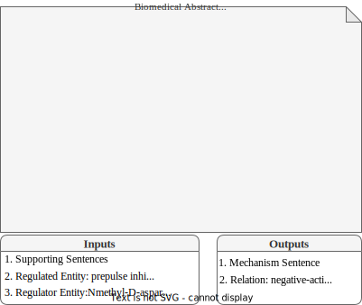
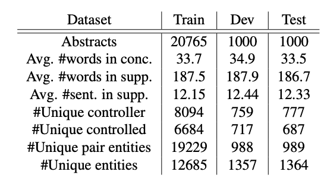

## What is SuMe?
### SuMe is a dataset towards Summarizing Biomedical Mechanisms.

 This is the official page for the paper <a href='https://aclanthology.org/2022.lrec-1.748/'> SuMe: A Dataset Towards Summarizing Biomedical Mechanisms </a>,  accepted at LREC2022.

<!-- Mohaddeseh Bastan, Nishant Shankar, Mihai Surdeanu, Niranjan Balasubramanian.  -->

SuMe is the first dataset towards summarizing biomedical mechanisms and the underlying relations between entities. The dataset contains 22K mechanism summarization instances collected semi-automatically and an evaluation partition of 125 instances that were corrected by domain experts. In addition it contains larger set of 611K abstracts for conclusion generation which we use as a pretraining task for mechanism generation models.

### Example
In the following example we see an example of an entry in the SuMe dataset. Some supporting text was removed to save space. The input is the supporting sentences with the main two entities. The output is the relation type and a sentence concluding the mechanism underlying the relationship.




### Dataset Statistics

We construct SuMe using biomedical abstracts from the PubMed open access subset. Starting from 1.1M scientific papers, we followed the following sequence of bootstrapping steps to prepare the SuMe dataset. 
1. Finding Conclusion Sentences
2. Extracting Main Entities & Relation. We run biomedical relation extractor, REACH which can identify entities and the relations between entities.
3. Filtering for Mechanism Sentences
We separate out the abstracts for which the conclusion sentences are predicted to have non-mechanism related conclusions as additional related data that can be use for pretraining the generation models we eventually train for the mechanism summarization task. Dataset Statistics: Each dataset contains a number of unique abstracts, a supporting set, a mechanism sentence a pair of entities. The first entity is called the regulator entity (regulator) and the second one is called the regulated entity (regulated)




### Download the data
The dataset contains four different subsets. 

The training set with about 21k abstracts. You can download training set from <a href="https://drive.google.com/file/d/13tewsb9IZOKvbvGyo199hJzg-IPwRAoO/view?usp=sharing">here</a>.

The validation set with about 1k abstract which the hyperparameters are tuned with can be found <a href="https://drive.google.com/file/d/1RKvoQqpHrOoOnLgizr9YtTIsioCHTRRl/view?usp=sharing">here</a>. 

The test sets is accessible via this link <a href="https://drive.google.com/file/d/10BsGKcZ-PCAs079fVn8U1KScdH2wNm8_/view?usp=sharing"> here </a>

The best model, which is pretrained with pretraining data and then fine tuned on training set is accessible <a href="https://drive.google.com/drive/folders/1yKqB-2X35f3DByqwgt5CCipPt0liIQKO?usp=sharing">here</a>.

### License
The dataset is collected using open source NIH active directory for PMC papers. We generally follow their license as mentioned <a href='https://www.ncbi.nlm.nih.gov/pmc/tools/openftlist/'> here </a>


### Liked us? Cite us!

Please use the following bibtex entry:
```
@article{bastan2022sume,
  title={SuMe: A Dataset Towards Summarizing Biomedical Mechanisms},
  author={Bastan, Mohaddeseh and Shankar, Nishant and Surdeanu, Mihai and Balasubramanian, Niranjan},
  journal={arXiv preprint arXiv:2205.04652},
  year={2022}
}
```

